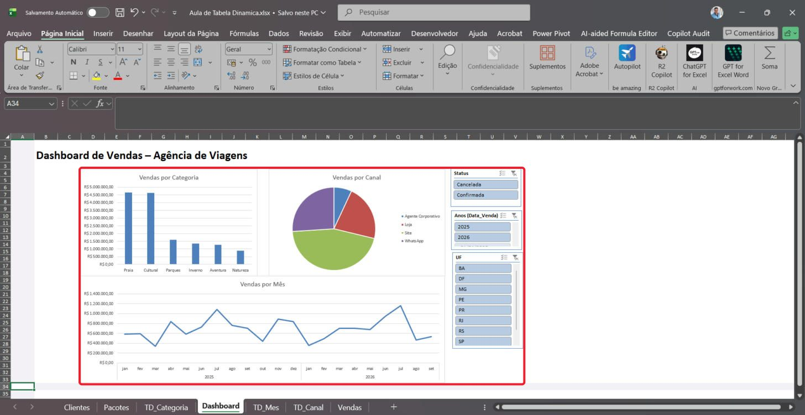

Excel · Aula prática · Agência de Viagens

# Aula de Tabela Dinâmica

Olá, turma! Hoje eu vou ensinar vocês a transformar 1.380 linhas de vendas de uma agência de viagens em um painel bonito, que responde perguntas com um clique.

Eu fiz cada passo de verdade no Excel e tirei um print de **cada clique**. O **círculo vermelho** mostra onde clicar. Sigam na ordem, sem pular, e no final vocês terão o mesmo dashboard da imagem ao lado.



É isto que vocês vão construir até o fim da aula.

Roteiro

[00Por que usar](#porque) [01Conhecer a nossa planilha](#parte1) [02Preparar a tabela de Vendas](#parte2) [03A primeira tabela dinâmica: vendas por categoria](#parte3) [04Segunda tabela dinâmica: vendas por mês](#parte4) [05Terceira tabela dinâmica: vendas por canal](#parte5) [06Transformar tabelas em gráficos](#parte6) [07Montar o Dashboard](#parte7) [08Segmentação de dados: os botões que filtram tudo](#parte8) [09Brincar com o Dashboard](#parte9)

Passos feitos: **0** de 64

Antes de clicar

## Por que a tabela dinâmica é tão boa?

Imaginem que o dono da agência pergunta: “Qual tipo de viagem mais vende? E em São Paulo? E só as vendas confirmadas?”. Para responder sem tabela dinâmica, vocês teriam que filtrar, somar, copiar e refazer tudo a cada pergunta. Com a tabela dinâmica, vocês arrastam um campo e a resposta aparece.

### Resume em segundos

1.380 linhas viram 7 linhas de resposta, sem nenhuma fórmula de soma.

### Não estraga os dados

Ela só lê a tabela de Vendas. Os dados originais ficam intactos.

### Muda de ideia fácil

Quer ver por canal em vez de categoria? Troca o campo e pronto.

### Segmentação filtra tudo junto

Um botão grande filtra vários gráficos ao mesmo tempo. Qualquer pessoa sabe usar.

**◯ Círculo** = clique aqui**▭ Retângulo** = olhe com atenção**botão DIREITO** = use o botão da direita do mouse**2 cliques rápidos** = clique duas vezes seguidas

Toque em qualquer print para ver em tamanho grande. Marquem “Fiz este passo” para acompanhar o progresso (fica salvo só no seu navegador).

Parte 1 de 9

## Conhecer a nossa planilha

Antes de construir qualquer coisa, eu quero que vocês conheçam o material. É como montar um quebra-cabeça: primeiro a gente olha as peças.

1PASSO

### Abra o arquivo e olhe as abas lá embaixo

Abram o arquivo **Aula3_Agencia_Viagens.xlsx** com dois cliques nele. O Excel vai abrir na aba **Clientes**.

Olhem a parte de **baixo** da tela. Ali tem três etiquetas, que a gente chama de *abas*: **Clientes**, **Pacotes** e **Vendas**. Cada aba é uma folha diferente do caderno.

Agora cliquem **uma vez** na aba **Vendas**, onde está o círculo vermelho.

**Dica do professor:** Clientes guarda quem compra. Pacotes guarda as viagens. Vendas guarda cada compra que aconteceu, com 1.380 linhas.

[ ] Fiz este passo

Parte 2 de 9

## Preparar a tabela de Vendas

A aba Vendas só tem números no lugar dos nomes: em vez de “Serra Gaúcha” está escrito 3. Ninguém entende um relatório cheio de códigos. Por isso eu vou ensinar vocês a trazer o nome do pacote, a categoria da viagem e o estado do cliente para dentro da tabela de Vendas.

2PASSO

### Clique na primeira célula vazia ao lado da tabela

Vejam que a tabela termina na coluna **L** (Avaliacao). A primeira coluna vazia é a **M**.

Cliquem **uma vez** na célula **M1**, onde está o círculo vermelho. Ela vai ficar com uma borda verde.

**Dica do professor:** Confiram no cantinho de cima, à esquerda (a Caixa de Nome). Tem que estar escrito M1.

[ ] Fiz este passo

3PASSO

### Escreva o nome da coluna e aperte Enter

Digitem a palavra **Pacote** e apertem a tecla Enter.

Olhem que mágica: a coluna M ficou com a mesma cor da tabela. O Excel percebeu que vocês estão aumentando a tabela e pintou a coluna nova sozinho.

Depois do Enter, o Excel desce para a célula **M2**, que está marcada no print. É nela que vamos escrever a fórmula.

[ ] Fiz este passo

4PASSO

### Digite a fórmula PROCX

Com a célula **M2** selecionada, digitem exatamente isto (letra por letra, sem espaço):

```
=PROCX(E2;tPacotes[ID_Pacote];tPacotes[Pacote])
```

Traduzindo para a nossa língua: *“Excel, pegue o número do pacote que está em E2, procure esse número na lista de pacotes e me devolva o nome do pacote.”*

A fórmula aparece também na barra lá em cima (marcada em vermelho). Confiram se está igual.

**Dica do professor:** Usem ponto e vírgula ( ; ) entre as partes. Se o seu Excel estiver em inglês, a função se chama XLOOKUP e usa vírgula.

[ ] Fiz este passo

5PASSO

### Aperte Enter e veja a coluna inteira se preencher

Apertem Enter. A coluna inteira, das 1.380 linhas, se preenche sozinha com os nomes dos pacotes: Foz do Iguaçu, Machu Picchu, Nordeste Encantado…

Vocês escreveram a fórmula uma vez só, e a tabela copiou para baixo. Isso acontece porque os dados estão numa **Tabela do Excel** (aquela listrada de laranja).

[ ] Fiz este passo

6PASSO

### Repita para Categoria e UF

Agora façam o mesmo duas vezes, sempre na próxima coluna vazia:

1. Cliquem em **N1**, digitem **Categoria** e Enter. Em **N2** digitem\
   `=PROCX(E2;tPacotes[ID_Pacote];tPacotes[Categoria])` e Enter.
2. Cliquem em **O1**, digitem **UF** e Enter. Em **O2** digitem\
   `=PROCX(D2;tClientes[ID_Cliente];tClientes[UF])` e Enter.

No final, a tabela de Vendas tem três colunas novas, marcadas em vermelho no print: **Pacote**, **Categoria** e **UF**.

**Dica do professor:** Atenção: a UF usa a coluna D (ID_Cliente), porque o estado mora na aba Clientes. As outras duas usam a coluna E (ID_Pacote).

[ ] Fiz este passo

Parte 3 de 9

## A primeira tabela dinâmica: vendas por categoria

Agora começa a parte boa. Eu quero saber: qual tipo de viagem vende mais? Praia? Cultural? Neve? Com 1.380 linhas, somar na mão levaria a tarde toda. A tabela dinâmica responde em três cliques.

7PASSO

### Abra a guia Inserir

Cliquem em **qualquer célula dentro da tabela** de Vendas (pode ser qualquer número da tabela). Isso é importante: o Excel precisa saber de qual tabela vocês estão falando.

Depois cliquem na palavra **Inserir**, lá no menu de cima, onde está o círculo vermelho.

[ ] Fiz este passo

8PASSO

### Clique no botão Tabela Dinâmica

A faixa de botões mudou. O primeiro botão da esquerda se chama **Tabela Dinâmica**. Cliquem nele (no desenho, não na setinha de baixo).

**Dica do professor:** Se aparecer um menu pequeno, escolham “Da Tabela/Intervalo”.

[ ] Fiz este passo

9PASSO

### Confira a janela e clique em OK

Abriu uma janelinha. Vamos conferir duas coisas antes de clicar:

1. Em **Tabela/Intervalo** tem que estar escrito **tVendas**. É o nome da nossa tabela de vendas.
2. A bolinha marcada tem que ser **Nova Planilha**. Assim a tabela dinâmica nasce numa folha limpinha só para ela.

Está tudo certo? Então cliquem em **OK**.

[ ] Fiz este passo

10PASSO

### Conheça a folha nova e o painel de campos

O Excel criou uma aba nova (**Planilha1**) e um quadro vazio escrito *Tabela dinâmica1*.

Do lado direito apareceu o painel **Campos da Tabela Dinâmica**. Ele tem duas partes, marcadas em vermelho:

- **Lá em cima, a lista de campos**: são os títulos das colunas da tabela de Vendas.
- **Lá embaixo, as quatro caixas**: Filtros, Colunas, Linhas e Valores. É onde a gente monta a pergunta.

**Dica do professor:** Pensem assim: Linhas é “sobre o que eu quero saber” e Valores é “o que eu quero contar ou somar”.

[ ] Fiz este passo

11PASSO

### Role a lista de campos para baixo

A lista é comprida e a nossa coluna Categoria está escondida lá no fim. Coloquem o mouse **em cima da lista** e girem a **rodinha do mouse** para baixo, até aparecer **Categoria**.

[ ] Fiz este passo

12PASSO

### Marque a caixinha Categoria

Cliquem no **quadradinho** ao lado da palavra **Categoria**.

**Dica do professor:** Se nada acontecer (às vezes o painel fica “cinza”), cliquem uma vez dentro do quadro da tabela dinâmica, na planilha, e depois cliquem no quadradinho de novo.

[ ] Fiz este passo

13PASSO

### Veja as categorias aparecerem

Pronto: as categorias apareceram uma embaixo da outra na planilha (Aventura, Cultural, Inverno, Natureza, Parques, Praia).

E olhem lá embaixo no painel: **Categoria** foi parar sozinha na caixa **Linhas**. O Excel coloca textos em Linhas automaticamente.

[ ] Fiz este passo

14PASSO

### Marque a caixinha Valor_Venda

Agora queremos o dinheiro. Rolem a lista um pouquinho para cima até achar **Valor_Venda** e cliquem no quadradinho dele.

[ ] Fiz este passo

15PASSO

### Leia o resultado

Apareceu a coluna **Soma de Valor_Venda** com o total vendido em cada categoria, e o **Total Geral** no fim: **R$ 14.423.510,00**.

O Valor_Venda foi para a caixa **Valores**, porque é número. Número a gente soma.

Vocês acabaram de resumir 1.380 linhas em 7 linhas. Esse é o poder da tabela dinâmica.

[ ] Fiz este passo

16PASSO

### Clique com o botão DIREITO em um valor

Está tudo fora de ordem. Eu quero o campeão em primeiro lugar.

Cliquem com o **botão DIREITO** do mouse (o botão da direita, não o de sempre) em cima de qualquer valor em dinheiro, por exemplo o da linha Aventura.

[ ] Fiz este passo

17PASSO

### Vá em Classificar

Abriu um menu comprido. Passem o mouse (ou cliquem) em **Classificar**.

[ ] Fiz este passo

18PASSO

### Escolha “do Maior para o Menor”

Apareceu um menu do lado. Cliquem em **Classificar do Maior para o Menor**.

[ ] Fiz este passo

19PASSO

### Pronto: o ranking das categorias

Agora sim: **Praia** em primeiro (R$ 4.667.165,00), **Cultural** quase empatada em segundo e **Natureza** em último.

Já dá para tirar uma conclusão de verdade: praia e viagens culturais respondem por quase dois terços do faturamento da agência.

[ ] Fiz este passo

20PASSO

### Dê dois cliques no nome da aba

“Planilha1” é um nome que não diz nada. Deem **dois cliques rápidos** na aba **Planilha1**, lá embaixo. O nome vai ficar selecionado.

[ ] Fiz este passo

21PASSO

### Escreva TD_Categoria e aperte Enter

Digitem **TD_Categoria** e apertem Enter.

**Dica do professor:** TD quer dizer Tabela Dinâmica. Usar sempre o mesmo começo ajuda a achar as abas depois.

[ ] Fiz este passo

Parte 4 de 9

## Segunda tabela dinâmica: vendas por mês

Agora eu quero ver o tempo: em que meses a agência vende mais? Vocês vão repetir o começo (é igual à Parte 3) e depois aprender um truque com datas.

22PASSO

### Crie a tabela e marque Data_Venda

Repitam os passos que vocês já sabem:

1. Cliquem na aba **Vendas** e em qualquer célula da tabela.
2. **Inserir** → **Tabela Dinâmica** → confiram **tVendas** e **Nova Planilha** → **OK**.

Na folha nova, cliquem no quadradinho de **Data_Venda** (é o segundo da lista).

[ ] Fiz este passo

23PASSO

### O Excel agrupou as datas sozinho

Olhem só: em vez de mostrar 600 datas diferentes, o Excel mostrou **2025** e **2026**.

Na caixa **Linhas** apareceram três campos novos: *Anos*, *Trimestres* e *Meses*. O Excel quebrou a data em pedaços para a gente.

[ ] Fiz este passo

24PASSO

### Clique com o botão direito em 2025

Eu não quero trimestres, só anos e meses. Cliquem com o **botão DIREITO** em cima do **2025**.

[ ] Fiz este passo

25PASSO

### Escolha Agrupar…

No menu, cliquem em **Agrupar…**.

[ ] Fiz este passo

26PASSO

### Desmarque Trimestres

Abriu a janela **Agrupamento**. Na lista **Por** estão pintados de azul: Meses, Trimestres e Anos.

Cliquem **uma vez** em **Trimestres** para tirar a cor azul dele.

[ ] Fiz este passo

27PASSO

### Confira e clique em OK

Agora só **Meses** e **Anos** estão azuis (marcados no print). Cliquem em **OK**.

[ ] Fiz este passo

28PASSO

### Os meses apareceram

Cada ano agora mostra seus meses: jan, fev, mar… E na caixa Linhas ficaram só **Anos** e **Meses**.

[ ] Fiz este passo

29PASSO

### Truque: deixe o painel mais fácil de usar

A lista de campos é pequena e dá trabalho rolar. Vamos arrumar isso. Cliquem na **engrenagem** que fica no alto do painel, à direita.

[ ] Fiz este passo

30PASSO

### Escolha “Lado a Lado”

Cliquem em **Seções Campos e Áreas Lado a Lado**.

[ ] Fiz este passo

31PASSO

### Agora todos os campos aparecem: marque Valor_Venda

A lista ficou alta e mostra todos os campos de uma vez (caixa vermelha). Cliquem no quadradinho de **Valor_Venda**.

[ ] Fiz este passo

32PASSO

### Renomeie a aba para TD_Mes

Os valores apareceram mês a mês. Vejam que **julho** é o mês mais forte nos dois anos: são as férias escolares.

Deem dois cliques na aba nova, digitem **TD_Mes** e Enter.

[ ] Fiz este passo

Parte 5 de 9

## Terceira tabela dinâmica: vendas por canal

A última pergunta: por onde os clientes compram? Site, WhatsApp, loja ou agente corporativo? Agora vocês já conseguem fazer sozinhos.

33PASSO

### Monte a tabela por Canal

1. Aba **Vendas** → clique numa célula da tabela.
2. **Inserir** → **Tabela Dinâmica** → **OK**.
3. Marquem **Canal** e depois **Valor_Venda**.
4. Renomeiem a aba para **TD_Canal**.

Resultado: o **Site** vende R$ 6.519.345,00, quase metade de tudo.

**Dica do professor:** Se um quadradinho não marcar no primeiro clique, cliquem de novo. O primeiro clique às vezes só “acorda” o painel.

[ ] Fiz este passo

Parte 6 de 9

## Transformar tabelas em gráficos

Número é ótimo para quem gosta de número. Mas o chefe da agência quer bater o olho e entender. Para isso servem os gráficos dinâmicos: eles ficam ligados à tabela dinâmica e mudam junto com ela.

34PASSO

### Clique em Gráfico Dinâmico

Ainda na aba **TD_Canal**, com uma célula da tabela dinâmica selecionada, olhem a guia **Análise de Tabela Dinâmica** lá em cima. Cliquem no botão **Gráfico Dinâmico**.

**Dica do professor:** Não achou a guia? Cliquem dentro da tabela dinâmica primeiro. Ela só aparece quando a tabela está selecionada.

[ ] Fiz este passo

35PASSO

### Escolha Pizza

Abriu a janela **Inserir Gráfico**. Na lista da esquerda, cliquem em **Pizza**.

Pizza é boa quando há poucas fatias (aqui são 4 canais) e a gente quer ver quem é o maior pedaço.

[ ] Fiz este passo

36PASSO

### Clique em OK

A pré-visualização mostra a pizza. Cliquem em **OK**.

[ ] Fiz este passo

37PASSO

### O gráfico apareceu

A pizza apareceu em cima da planilha. A fatia verde (Site) é a maior, como a tabela já mostrava.

[ ] Fiz este passo

38PASSO

### Clique no título “Total”

“Total” não explica nada. Cliquem **uma vez** na palavra **Total**, no alto do gráfico. Vai aparecer uma moldura em volta dela.

[ ] Fiz este passo

39PASSO

### Digite o título novo

Digitem **Vendas por Canal** e apertem Enter. O título mudou.

**Dica do professor:** Se o texto novo se misturar com o antigo, cliquem de novo no título, apertem Ctrl + A para selecionar tudo e digitem outra vez.

[ ] Fiz este passo

40PASSO

### Faça o gráfico de linhas na aba TD_Mes

Na aba **TD_Mes**, cliquem numa célula da tabela dinâmica → **Análise de Tabela Dinâmica** → **Gráfico Dinâmico** → **Linhas** → **OK**.

Troquem o título para **Vendas por Mês**. Depois cliquem na legenda “Total” do lado direito e apertem Delete para apagá-la.

Linha é o melhor gráfico para mostrar algo que muda com o tempo: dá para ver os picos de julho.

[ ] Fiz este passo

41PASSO

### Faça o gráfico de colunas na aba TD_Categoria

Na aba **TD_Categoria**, mesmo caminho: **Gráfico Dinâmico** → deixem **Colunas** (já vem escolhido) → **OK**.

Título: **Vendas por Categoria**. Apaguem a legenda como antes.

[ ] Fiz este passo

Parte 7 de 9

## Montar o Dashboard

Dashboard é o “painel do carro” da empresa: tudo importante numa tela só. Vamos criar uma folha nova e trazer os três gráficos para ela.

42PASSO

### Clique no + para criar uma folha nova

Lá embaixo, depois da última aba, tem um sinal de **+**. Cliquem nele.

[ ] Fiz este passo

43PASSO

### Chame a folha de Dashboard

Deem dois cliques na aba nova, digitem **Dashboard** e Enter.

[ ] Fiz este passo

44PASSO

### Abra a guia Exibir

Para o painel ficar limpo, vamos esconder as linhas de grade. Cliquem em **Exibir**, no menu de cima.

[ ] Fiz este passo

45PASSO

### Desmarque Linhas de Grade

Cliquem no quadradinho **Linhas de Grade** para tirar o ✓. A folha fica branquinha, como uma tela de apresentação.

[ ] Fiz este passo

46PASSO

### Escreva o título do painel

Cliquem na célula **B2** e digitem **Dashboard de Vendas – Agência de Viagens** e Enter.

Cliquem de novo em B2. Na guia **Página Inicial**, mudem o tamanho da letra para **24** (caixinha marcada) e cliquem no **N** de negrito.

[ ] Fiz este passo

47PASSO

### Selecione o gráfico e recorte

Vão até a aba **TD_Categoria**. Cliquem **uma vez na borda branca** do gráfico (fora das colunas). Aparecem bolinhas nos cantos: o gráfico está selecionado.

Agora apertem Ctrl + X (segurem Ctrl e apertem X). Isso **recorta** o gráfico, como uma tesoura.

[ ] Fiz este passo

48PASSO

### Na aba Dashboard, clique em D4

Voltem para a aba **Dashboard** e cliquem na célula **D4**. É ali que o canto do gráfico vai ficar.

[ ] Fiz este passo

49PASSO

### Cole com Ctrl + V

Apertem Ctrl + V. O gráfico de categorias chegou ao Dashboard.

Façam igual com os outros dois:

- Gráfico de pizza da aba **TD_Canal** → colem na célula **L4**.
- Gráfico de linhas da aba **TD_Mes** → colem na célula **D19**.

**Dica do professor:** Recortar (Ctrl+X) tira o gráfico de lá e põe aqui. O gráfico continua ligado à sua tabela dinâmica.

[ ] Fiz este passo

Parte 8 de 9

## Segmentação de dados: os botões que filtram tudo

Esta é a estrela da aula. Segmentação de dados são botões grandes que filtram as informações com um clique. E o melhor: um botão só pode filtrar os três gráficos ao mesmo tempo.

50PASSO

### Selecione um gráfico e clique em Inserir Segmentação de Dados

Na aba Dashboard, cliquem em um dos gráficos (eu cliquei no de linhas). Lá em cima aparece a guia **Análise de Gráfico Dinâmico** (caixa vermelha).

Cliquem no botão **Inserir Segmentação de Dados**.

[ ] Fiz este passo

51PASSO

### Marque Status, UF e Anos

Abriu uma lista com todos os campos. Marquem três quadradinhos:

- **Status**: para separar vendas confirmadas das canceladas;
- **UF**: para ver cada estado;
- **Anos (Data_Venda)**: para comparar 2025 com 2026.

[ ] Fiz este passo

52PASSO

### Clique em OK

Confiram os três ✓ e cliquem em **OK**.

[ ] Fiz este passo

53PASSO

### As segmentações apareceram (ainda bagunçadas)

Apareceram três caixas cheias de botões, uma em cima da outra. Calma, vamos organizar já já.

Mas antes tem uma coisa muito importante: por enquanto, esses botões só controlam **um** gráfico, o que estava selecionado. Vamos ligar nos três.

[ ] Fiz este passo

54PASSO

### Clique em Conexões de Relatório

Cliquem no título de uma segmentação (eu comecei pela **Anos**). Lá em cima aparece a guia **Segmentação**. Cliquem em **Conexões de Relatório**.

[ ] Fiz este passo

55PASSO

### Marque as tabelas que faltam

A janela mostra as três tabelas dinâmicas. Só a **TD_Mes** está marcada. Cliquem nos quadradinhos de **TD_Canal** e **TD_Categoria**.

[ ] Fiz este passo

56PASSO

### Todas marcadas: clique em OK

As três com ✓. Cliquem em **OK**.

**Façam a mesma coisa com as outras duas segmentações** (Status e UF): cliquem no título → Conexões de Relatório → marquem as três → OK.

**Dica do professor:** Se esquecer este passo, o botão filtra um gráfico e os outros ficam parados. É o erro mais comum da turma.

[ ] Fiz este passo

57PASSO

### Esconda os botões cinza dos gráficos

Organizem as segmentações arrastando pelo título para o lado direito dos gráficos, uma embaixo da outra. Para diminuir uma caixa, puxem a bolinha de baixo dela para cima.

Os gráficos têm uns botões cinza (“Soma de Valor_Venda”, “Categoria”). Para tirar: cliquem com o **botão direito** em um deles e escolham **Ocultar Todos os Botões de Campo no Gráfico**. Repitam em cada gráfico.

**Dica do professor:** Para ver tudo numa tela só, cliquem no 100% lá embaixo, à direita, e escolham Personalizar: 70%.

[ ] Fiz este passo

58PASSO

### O Dashboard está pronto

Três gráficos e três segmentações numa tela só. Parabéns: isso é um dashboard de verdade, igual aos que as empresas usam.

[ ] Fiz este passo

Parte 9 de 9

## Brincar com o Dashboard

Agora é hora de fazer perguntas e deixar o Dashboard responder.

59PASSO

### Clique em Confirmada

Na segmentação **Status**, cliquem no botão **Confirmada**.

[ ] Fiz este passo

60PASSO

### Os três gráficos mudaram juntos

O botão Confirmada ficou azul e o Cancelada ficou branco. Os três gráficos mudaram ao mesmo tempo: agora só mostram vendas que aconteceram de verdade.

Isso é importante: com as canceladas o total era R$ 14,4 milhões; só com as confirmadas cai para **R$ 12,5 milhões**. Quase dois milhões eram vendas que não se concretizaram.

[ ] Fiz este passo

61PASSO

### Agora clique em SP

Na segmentação **UF**, cliquem em **SP**.

[ ] Fiz este passo

62PASSO

### Descoberta: em São Paulo o campeão muda

Olhem o gráfico de categorias: em São Paulo, **Cultural** passou **Praia**! No Brasil todo a Praia ganha, mas os clientes paulistas preferem viagens culturais.

Essa descoberta levou dois cliques. Sem tabela dinâmica seriam horas de filtro e soma.

**Dica do professor:** Para escolher mais de um botão ao mesmo tempo (por exemplo SP e RJ), segurem a tecla Ctrl enquanto clicam.

[ ] Fiz este passo

63PASSO

### Limpe os filtros

Para voltar a ver tudo, cliquem no **funil com um X vermelho**, no canto de cada segmentação.

[ ] Fiz este passo

64PASSO

### Salve o trabalho

Tudo de volta ao normal. Agora apertem Ctrl + B para salvar. No Excel em português o atalho de salvar é Ctrl + B (no inglês é Ctrl + S).

Missão cumprida!

[ ] Fiz este passo

Desafio final

## Agora é com vocês

- Criem uma quarta tabela dinâmica com **Pacote** em Linhas e **Qtd_Passageiros** em Valores. Qual pacote levou mais gente?
- Adicionem uma segmentação de **Categoria** no Dashboard e liguem nas quatro tabelas.
- Filtrem **2026** e **RJ**. Qual canal vende mais no Rio?
- Lembrem: se a tabela de Vendas ganhar linhas novas, cliquem em **Dados → Atualizar Tudo** para o Dashboard se atualizar.